```python
%matplotlib inline
import numpy as np
import pandas as pd
import matplotlib.pyplot as plt
from datetime import date
import sklearn
import itertools
import re
import string
import csv

df = pd.read_csv('C:\\Users\\DELL\\Desktop\\data_scientist\\PROJ1\\d\\y1.txt', sep="\n", header = None, error_bad_lines=False)
df['gender'] = pd.read_csv('C:\\Users\\DELL\\Desktop\\data_scientist\\PROJ1\\d\\y2.txt', sep="\n", header = None, error_bad_lines=False)
df.columns = ['message', 'gender']

df1 = df[df.gender == 0].sample(5000, random_state=43)
df2 = df[df.gender == 1].sample(5000, random_state=43)
df=pd.concat([df1,df2])
df.index=range(0,10000)
```

    b'Skipping line 3570: expected 1 fields, saw 2\nSkipping line 3573: expected 1 fields, saw 2\nSkipping line 3582: expected 1 fields, saw 2\nSkipping line 3642: expected 1 fields, saw 2\nSkipping line 3682: expected 1 fields, saw 2\nSkipping line 3796: expected 1 fields, saw 2\nSkipping line 4172: expected 1 fields, saw 2\nSkipping line 4175: expected 1 fields, saw 2\nSkipping line 4295: expected 1 fields, saw 2\nSkipping line 4695: expected 1 fields, saw 2\nSkipping line 4769: expected 1 fields, saw 2\nSkipping line 4906: expected 1 fields, saw 2\nSkipping line 4964: expected 1 fields, saw 2\nSkipping line 5231: expected 1 fields, saw 2\nSkipping line 5317: expected 1 fields, saw 2\nSkipping line 5345: expected 1 fields, saw 2\nSkipping line 5661: expected 1 fields, saw 2\nSkipping line 5721: expected 1 fields, saw 2\nSkipping line 5730: expected 1 fields, saw 2\nSkipping line 5867: expected 1 fields, saw 2\nSkipping line 5888: expected 1 fields, saw 2\nSkipping line 5915: expected 1 fields, saw 2\nSkipping line 6031: expected 1 fields, saw 2\nSkipping line 6171: expected 1 fields, saw 2\nSkipping line 6208: expected 1 fields, saw 2\nSkipping line 6255: expected 1 fields, saw 2\nSkipping line 6869: expected 1 fields, saw 2\nSkipping line 6939: expected 1 fields, saw 2\nSkipping line 7045: expected 1 fields, saw 2\nSkipping line 7335: expected 1 fields, saw 2\nSkipping line 7620: expected 1 fields, saw 2\nSkipping line 7696: expected 1 fields, saw 2\nSkipping line 7731: expected 1 fields, saw 2\nSkipping line 8196: expected 1 fields, saw 2\nSkipping line 8201: expected 1 fields, saw 2\nSkipping line 8211: expected 1 fields, saw 2\nSkipping line 8240: expected 1 fields, saw 2\nSkipping line 8392: expected 1 fields, saw 2\nSkipping line 9043: expected 1 fields, saw 2\nSkipping line 9403: expected 1 fields, saw 2\nSkipping line 9648: expected 1 fields, saw 2\nSkipping line 9691: expected 1 fields, saw 2\nSkipping line 10205: expected 1 fields, saw 2\nSkipping line 10273: expected 1 fields, saw 2\nSkipping line 10706: expected 1 fields, saw 3\nSkipping line 10780: expected 1 fields, saw 2\nSkipping line 10846: expected 1 fields, saw 2\nSkipping line 11297: expected 1 fields, saw 2\nSkipping line 11522: expected 1 fields, saw 2\n'
    


```python
#example of dataframe struct
df.head(5)
```


<div>
<table border="1" class="dataframe">
  <thead>
    <tr style="text-align: right;">
      <th></th>
      <th>message</th>
      <th>gender</th>
    </tr>
  </thead>
  <tbody>
    <tr>
      <th>0</th>
      <td>למה</td>
      <td>0</td>
    </tr>
    <tr>
      <th>1</th>
      <td>הפה שלנ התייב,</td>
      <td>0</td>
    </tr>
    <tr>
      <th>2</th>
      <td>חחחחח</td>
      <td>0</td>
    </tr>
    <tr>
      <th>3</th>
      <td>תשאל את אנונימוס אני עם טכנאי</td>
      <td>0</td>
    </tr>
    <tr>
      <th>4</th>
      <td>אולי רק על נושא ההטיוץ</td>
      <td>0</td>
    </tr>
  </tbody>
</table>
</div>


# Text Cleaning
1. remove punctuation
2. remove stopwords


```python
# remove punctuation from data
regex = re.compile('[%s]' % re.escape(string.punctuation))
df['message_clean']= df['message'].apply(lambda x: regex.sub('', x))
```


```python
from collections import Counter
#creat stop-words - the x most frequent words 
result=df.message_clean.apply(lambda x: pd.value_counts(x.split(" "))).sum(axis = 0)
result=result.sort_values(ascending=False)
stop=result.head(500)
#remove stop-words
df['message_clean'] = df['message_clean'].apply(lambda x: ' '.join([word for word in x.split() if word not in (stop)]))
```

# Feature extraction
1. number of words in message
2. number of sentances in message
3. number of punctuation in message
4. check suffix ת after אני- eg. אני חושבת
5. general emojis
6. feminine emojis- hearts, flowers..
7. sequences like חחחח
8. relevance to topic
9. best topic for each example


```python
#word count
df['word_count']=df['message'].apply(lambda x: len(x.split(' '))-1)
reg_line = re.compile('([^.\\n;?!]* *[.\\n;?!]+)[ .\\n;?!]*|[^.\\n;?!]+$')
#sentances count
df['sen_count']=df['message'].apply(lambda x: len(re.findall(reg_line,x)))
#punctuation count
reg = """[\.\!\?\"\-\,\']+"""
df['punctuation']=df['message'].apply(lambda x: len(re.findall(reg, x)))
```


```python
regex='(אני+ [א|ב|ג|ד|ה|ו|ז|ח|ט|י|כ|ל|נ|ס|ע|פ|צ|ק|ר|ש|ת]+ת)'
df['suffix']=df['message'].apply(lambda x: len(re.findall(regex,x)))
regex='(אני+ [א|ב|ג|ד|ה|ו|ז|ח|ט|י|כ|ל|נ|ס|ע|פ|צ|ק|ר|ש|ת]+ה)'
df['suffix2']=df['message'].apply(lambda x: len(re.findall(regex,x)))
```


```python
reg='😀|😃|😄|😁|😆|😅|😂|🤣|☺|😊|😇|🙂|🙃|😉|😌|😍|😘|😔|😞|😒|😏|🤠|🤡|😎|🤓|🤗|🤑|😛|😝|😜|😋|😚|😙|😗|😧|🤥|👾|😦|🤔|👽|😯|🙄|☠|😑|😴|💀|😐|😪|👻|💩|😓|😶|😡|😭|👺|👹|🤤|😠|😤|😥|👿|😈|😢|😩|😫|😰|🤕|🤒|😨|😖|😣|😱|😷|🤧|😳|☹|🙁|😵|🤢|🤐|😲|😕|😟|😮|😬|👍|👌|🖕|🍺|🍻'
reg2='👩‍|❤‍|💋‍|👩|👨‍|❤‍|💋‍|👨|💏|👨‍|❤‍|👨|👩‍|❤‍|👩|💑|💋|💄|♥|❤|💛|💚|💙|💜|💔|💕|🌷|🌹|🌻|🌼|🌸|🌺'
df['emoji']=df['message_clean'].apply(lambda x: len(re.findall(reg,x)))
df['emoji2']=df['message_clean'].apply(lambda x: len(re.findall(reg2,x)))
```


```python
reg='אאא+|בבב+|גגג+|דדד+|ההה+|ווו+|זזז+|חחח+|טטט+|ייי+|כככ+|ללל+|מממ+|נננ+|ססס+|עעע+|פפפ+|צצצ+|קקק+|ררר+|ששש+|תתת+|םםם+|ףףף+|ךךך+|ץץץ+'
df['sequence']=df['message'].apply(lambda x: len(re.findall(reg,x)))
```

# Topic Modeling
A generative statistical model that allows sets of observations to be explained by unobserved groups that explain why some parts of the data are similar.
+ 4 topics
+ min df=10
+ max df=0.1


```python
from sklearn.feature_extraction.text import CountVectorizer
from sklearn.decomposition import LatentDirichletAllocation

vectorizer = CountVectorizer(min_df=10, max_df=0.1, encoding="cp1255")
# matrix [doc,term] for each entry number of occurence of term t in doc d
mat = vectorizer.fit_transform(df["message_clean"])
lda = LatentDirichletAllocation(n_topics=4)
## matrix [doc,topic] for each entry probability of topic t in doc d
topics = lda.fit_transform(mat)

df_topics_words = pd.DataFrame()
for i in range(lda.components_.shape[0]):
    k=pd.DataFrame(lda.components_, columns=vectorizer.get_feature_names()).T[i].sort_values(ascending=False).head(100)
    df_topics_words['topic '+str(i)+' words'] = k.index
    df_topics_words['topic '+str(i)+' value'] = k.values
    d=dict(zip(vectorizer.get_feature_names(),map(lambda x: int(x),lda.components_[0])))
```

    C:\Users\DELL\Anaconda3\envs\py35\lib\site-packages\sklearn\decomposition\online_lda.py:508: DeprecationWarning: The default value for 'learning_method' will be changed from 'online' to 'batch' in the release 0.20. This warning was introduced in 0.18.
      DeprecationWarning)
    


```python
#create docs-topics df
for i in range(topics.shape[1]):
    df['topic_'+str(i)]=pd.to_numeric(topics.T[i])
```


```python
df_topics_words.head(5)
```


<div>
<table border="1" class="dataframe">
  <thead>
    <tr style="text-align: right;">
      <th></th>
      <th>topic 0 words</th>
      <th>topic 0 value</th>
      <th>topic 1 words</th>
      <th>topic 1 value</th>
      <th>topic 2 words</th>
      <th>topic 2 value</th>
      <th>topic 3 words</th>
      <th>topic 3 value</th>
    </tr>
  </thead>
  <tbody>
    <tr>
      <th>0</th>
      <td>11</td>
      <td>19.408257</td>
      <td>אהיה</td>
      <td>12.322042</td>
      <td>אביב</td>
      <td>12.385727</td>
      <td>אתכן</td>
      <td>13.287991</td>
    </tr>
    <tr>
      <th>1</th>
      <td>הזמן</td>
      <td>11.180800</td>
      <td>אבא</td>
      <td>11.080149</td>
      <td>הולכת</td>
      <td>11.912782</td>
      <td>אומרים</td>
      <td>11.329847</td>
    </tr>
    <tr>
      <th>2</th>
      <td>הן</td>
      <td>10.624770</td>
      <td>טעים</td>
      <td>11.055222</td>
      <td>אדמה</td>
      <td>11.871085</td>
      <td>השאלה</td>
      <td>10.963645</td>
    </tr>
    <tr>
      <th>3</th>
      <td>מצחיק</td>
      <td>10.406722</td>
      <td>זהו</td>
      <td>10.673557</td>
      <td>הורסת</td>
      <td>11.789491</td>
      <td>אף</td>
      <td>10.656027</td>
    </tr>
    <tr>
      <th>4</th>
      <td>בעבודה</td>
      <td>10.320690</td>
      <td>אעשה</td>
      <td>10.476023</td>
      <td>בלילה</td>
      <td>11.692580</td>
      <td>ויש</td>
      <td>10.427392</td>
    </tr>
  </tbody>
</table>
</div>


```python
#best topic for each example
df["topic"] = df[["topic_0", "topic_1", "topic_2", "topic_3"]].idxmax(axis=1)
```

# Visualization


```python
colorm='coolwarm'
```

number of messages for each gender 


```python
df.gender.groupby(df.gender).agg(['count'])
```


<div>
<table border="1" class="dataframe">
  <thead>
    <tr style="text-align: right;">
      <th></th>
      <th>count</th>
    </tr>
    <tr>
      <th>gender</th>
      <th></th>
    </tr>
  </thead>
  <tbody>
    <tr>
      <th>0</th>
      <td>5000</td>
    </tr>
    <tr>
      <th>1</th>
      <td>5000</td>
    </tr>
  </tbody>
</table>
</div>


```python
plot6=df[['sequence']].groupby(df.gender).agg(['mean'])
plot6.plot(kind='bar', stacked=True, grid=False, title='mean count of sequences by gender', colormap=colorm)
```


    <matplotlib.axes._subplots.AxesSubplot at 0x17ee3e4ddd8>


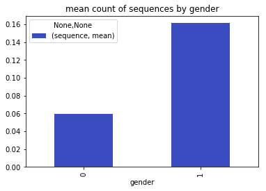


```python
plot5=df[['emoji2']].groupby(df.gender).agg(['mean'])
plot5.plot(kind='bar', stacked=True, grid=False, title='mean count of feminine emojis- by gender', colormap=colorm)
```


    <matplotlib.axes._subplots.AxesSubplot at 0x17ee34b8898>


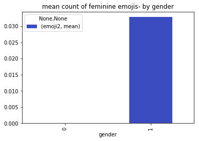


```python
plot0=df[['emoji']].groupby(df.gender).agg(['mean'])
plot0.plot(kind='bar', stacked=True, grid=False, title='mean count of general emojis- by gender', colormap=colorm)
```


    <matplotlib.axes._subplots.AxesSubplot at 0x17ee33b9748>


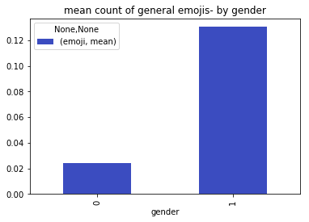


```python
plot2=df[['word_count']].groupby(df.gender).agg(['mean'])
plot2.plot(kind='bar', stacked=True, grid=False, title='mean of number words- by gender', colormap=colorm)

df[0:11775].boxplot(column='word_count', by = 'gender')
```


    <matplotlib.axes._subplots.AxesSubplot at 0x17ee3c9a2e8>


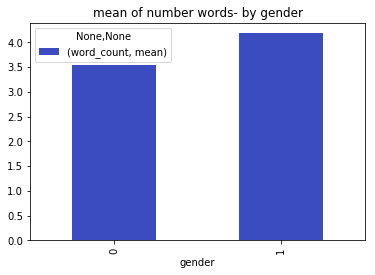


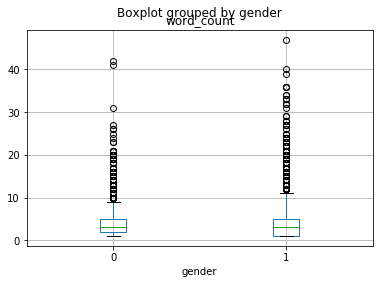


```python
plot3=df[['sen_count']].groupby(df.gender).agg(['mean'])
plot3.plot(kind='bar', stacked=True, grid=False, title='mean of number sentances- by gender', colormap=colorm)

df.boxplot(column='sen_count', by = 'gender')
```


    <matplotlib.axes._subplots.AxesSubplot at 0x17ee3771a20>


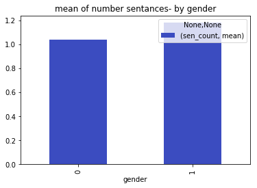


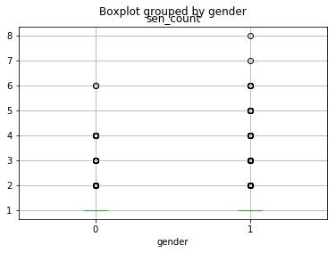


```python
plot4=df[['punctuation']].groupby(df.gender).agg(['mean'])
plot4.plot(kind='bar', stacked=True, grid=False, title='mean of number punctuation- by gender', colormap=colorm)

df.boxplot(column='punctuation', by = 'gender')
```


    <matplotlib.axes._subplots.AxesSubplot at 0x17ee32a62e8>


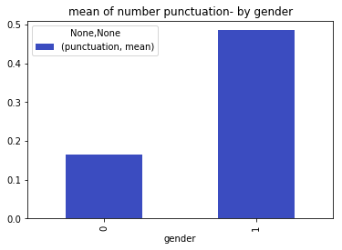


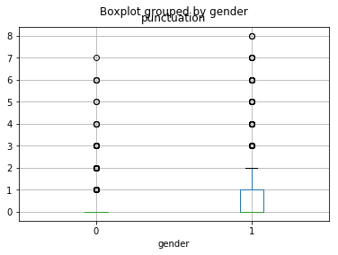


```python
df3=df.groupby(by=['topic','gender']).size().unstack(level=-1).fillna(0).apply(lambda x: x.apply(lambda y: y/x.sum()),axis=1)
ax=df3.plot.barh(stacked=True,figsize=(10,8),grid=False,fontsize=12,title='Distribution of each topic at gender', colormap=colorm)
plt.show()
```


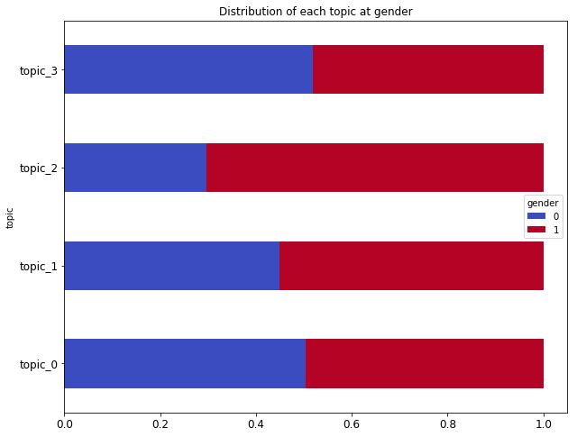


```python
# import Levenshtein
# from difflib import SequenceMatcher

# #distances between male messages and fimale messages

# for i in range(0,1):
#     data_f=df[df['gender']==1]
#     data_m=df[df['gender']==0]
#     list_f=list(data_f.message_clean.values)
#     list_m=list(data_m.message_clean.values)
#     list_dist=list()
#     for i in list_m:
#         for j in list_f:
#             list_dist.append(float(SequenceMatcher(None, i, j).ratio()))

# import matplotlib.mlab as mlab

# # histogram of the distances data
# n, bins, patches = plt.hist(list_dist, 100, normed=3, facecolor='green', alpha=0.75)
# plt.grid(True)
# plt.show()
```

# MODELING

discretization of features


```python
# discrete sequence feature
split = np.array_split(np.sort(df.sequence), 5)
cutoffs = [x[-1] for x in split]
cutoffs = cutoffs[:-1]
discrete = np.digitize(df.sequence, cutoffs, right=True)
df.sequence= discrete

# discrete suffix2 feature
split = np.array_split(np.sort(df.suffix2), 5)
cutoffs = [x[-1] for x in split]
cutoffs = cutoffs[:-1]
discrete = np.digitize(df.suffix2, cutoffs, right=True)
df.suffix2= discrete

# discrete suffix feature
split = np.array_split(np.sort(df.suffix), 5)
cutoffs = [x[-1] for x in split]
cutoffs = cutoffs[:-1]
discrete = np.digitize(df.suffix, cutoffs, right=True)
df.suffix= discrete

# discrete word_count feature
split = np.array_split(np.sort(df.word_count), 5)
cutoffs = [x[-1] for x in split]
cutoffs = cutoffs[:-1]
discrete = np.digitize(df.word_count, cutoffs, right=True)
df.word_count= discrete

# discrete emoji2 feature
split = np.array_split(np.sort(df.emoji2), 5)
cutoffs = [x[-1] for x in split]
cutoffs = cutoffs[:-1]
discrete = np.digitize(df.emoji2, cutoffs, right=True)
df.emoji2= discrete

# discrete emoji feature
split = np.array_split(np.sort(df.emoji), 5)
cutoffs = [x[-1] for x in split]
cutoffs = cutoffs[:-1]
discrete = np.digitize(df.emoji, cutoffs, right=True)
df.emoji= discrete

# discrete punctuation feature
split = np.array_split(np.sort(df.punctuation), 5)
cutoffs = [x[-1] for x in split]
cutoffs = cutoffs[:-1]
discrete = np.digitize(df.punctuation, cutoffs, right=True)
df.punctuation= discrete

```

transform topic feature


```python
from sklearn import preprocessing
le = preprocessing.LabelEncoder()
df['topic'] = le.fit_transform(df['topic'])
```

Transforms features by scaling


```python
from sklearn.preprocessing import MinMaxScaler
scaler = MinMaxScaler()
columnn=['emoji', 'emoji2', 'sequence', 'word_count', 'sen_count', 'punctuation']
df[columnn] = scaler.fit_transform(df[columnn])
```


```python
#dict for results
Allresults= {'RandomForest': list(), 'GradientBoosting': list()}
```


```python
from sklearn.cross_validation import train_test_split

cols=['emoji','emoji2','sequence','suffix2',
       'word_count', 'sen_count', 'punctuation', 'topic_0', 'topic_1',
       'topic_2', 'topic_3','suffix']

X=df[cols]
Y=df['gender']

#Split to validation and train set
training_features,testing_features,training_classes,testing_classes = train_test_split(X,Y,test_size=0.25,random_state=48)
```

    C:\Users\DELL\Anaconda3\envs\py35\lib\site-packages\sklearn\cross_validation.py:44: DeprecationWarning: This module was deprecated in version 0.18 in favor of the model_selection module into which all the refactored classes and functions are moved. Also note that the interface of the new CV iterators are different from that of this module. This module will be removed in 0.20.
      "This module will be removed in 0.20.", DeprecationWarning)
    


```python
from sklearn.metrics import confusion_matrix

def plot_confusion_matrix(cm, classes,
                      normalize=False,
                      title='Confusion matrix',
                      cmap=plt.cm.Purples):
    """
    This function prints the confusion matrix.
    """
    if normalize:
        cm = cm.astype('float') / cm.sum(axis=1)[:, np.newaxis]
        print("Normalized confusion matrix")
    else:
        print('Confusion matrix')

    print(cm)
```

# RandomForestClassifier
0. RandomForestClassifier:  criterion- gini, number of trees=500
1. training (training_features, training_classes)
2. predict (testing_features)
3. calc Accuracy score
4. calc F1-score with 5cv
5. feature importances
6. calc precision_recall_fscore_support scores
7. calc cohen_kappa_score
8. confusion_matrix


```python
from sklearn.ensemble import RandomForestClassifier
from sklearn.metrics import f1_score
from sklearn.model_selection import cross_val_score
from sklearn.metrics import precision_recall_fscore_support
from sklearn.metrics import classification_report,confusion_matrix

rf = RandomForestClassifier(criterion='gini', 
                         n_estimators=500, #The number of trees in the forest
                         min_samples_split=10,
                         min_samples_leaf=1,
                         max_features='auto',
                         oob_score=True,
                         random_state=1,
                         n_jobs=-1)

rf.fit(training_features, training_classes)
results = rf.predict(testing_features)
```


```python
#Accuracy
scores=rf.score(testing_features, testing_classes)
print(scores)
Allresults['RandomForest'].append(float(scores))
```

    0.6728
    


```python
#5cv- f1_micro score
score_cv = cross_val_score(rf, X, Y, cv=5, scoring='f1_micro')
print("RandomForest_score_cv: %0.2f (+/- %0.2f)" % (score_cv.mean(), score_cv.std() * 2))
Allresults['RandomForest'].append(float(score_cv.mean()))
```

    RandomForest_score_cv: 0.67 (+/- 0.02)
    


```python
#Create a series with feature importances:
importances=rf.feature_importances_
print(pd.Series(importances, index=cols).sort_values(ascending=False))
```

    punctuation    0.319498
    emoji          0.142884
    sequence       0.129790
    sen_count      0.102485
    word_count     0.096711
    emoji2         0.044812
    topic_2        0.035833
    topic_0        0.029338
    topic_1        0.029332
    topic_3        0.026021
    suffix2        0.022172
    suffix         0.021124
    dtype: float64
    


```python
#cohen_kappa_score
kappa=sklearn.metrics.cohen_kappa_score(results, testing_classes, labels=None, weights=None)
print(kappa)
Allresults['RandomForest'].append(float(kappa))
```

    0.345942830606
    


```python
#precision_recall_fscore_support
c_report=classification_report(testing_classes,results)
print(c_report)
Allresults['RandomForest'].append(float(c_report.splitlines()[5].split()[5]))
Allresults['RandomForest'].append(float(c_report.splitlines()[5].split()[4]))
Allresults['RandomForest'].append(float(c_report.splitlines()[5].split()[3]))
```

                 precision    recall  f1-score   support
    
              0       0.64      0.78      0.70      1247
              1       0.72      0.56      0.63      1253
    
    avg / total       0.68      0.67      0.67      2500
    
    


```python
#confusion_matrix
c_matrix=confusion_matrix(testing_classes,results)   
classes=df.gender.unique()
plot_confusion_matrix(c_matrix, classes)
plot_confusion_matrix(c_matrix, classes, normalize=True, title='Normalized confusion matrix')
```

    Confusion matrix
    [[976 271]
     [547 706]]
    Normalized confusion matrix
    [[ 0.78267843  0.21732157]
     [ 0.43655227  0.56344773]]
    

# TPOTClassifier
we use Tpot package for optimizes machine learning
TPOT is a Python Automated Machine Learning tool that optimizes machine learning pipelines using genetic programming


```python
# import pandas as pd  
# from sklearn.cross_validation import train_test_split  
# from tpot import TPOTClassifier  
# from sklearn.datasets import load_digits

# msk = np.random.rand(len(df3)) < 0.8
# train_x = tfidf_matrix[msk]
# test_x = tfidf_matrix[~msk]
# train_y = df3.loc[msk,"gender"]
# test_y = df3.loc[~msk,"gender"]

# #train model with tpot package- with genetic algorithm
  
# my_tpot = TPOTClassifier(generations=6)  
# my_tpot.fit(train_x, train_y)  
  
# print(my_tpot.score(test_x, test_y))  
# my_tpot.export('C:\\Users\\DELL\\Desktop\\data_model\\11p.py')
```

## GradientBoostingClassifier- result of tpot
0. GradientBoostingClassifier- max_depth=7, n_estimators=100
1. training (training_features, training_classes)
2. predict (testing_features)
3. F1-score with 10cv
4. precision_recall_fscore_support scores
5. cohen_kappa_score
6. confusion_matrix


```python
from sklearn.ensemble import ExtraTreesClassifier, VotingClassifier
from sklearn.feature_selection import VarianceThreshold
from sklearn.pipeline import make_pipeline, make_union
from sklearn.preprocessing import FunctionTransformer, MaxAbsScaler
from sklearn.ensemble import GradientBoostingClassifier

exported_pipeline = GradientBoostingClassifier(max_depth=7, max_features=0.35000000000000003, min_samples_leaf=6, min_samples_split=13, n_estimators=100)
exported_pipeline.fit(training_features, training_classes)
results = exported_pipeline.predict(testing_features)
```


```python
#ACCURACY
scores=exported_pipeline.score(testing_features, testing_classes)
print(scores)
Allresults['GradientBoosting'].append(float(scores))
```

    0.6728
    


```python
#SCORE 10CV BY F1-SCORE=2*(PRECISION*RECALL)/PRECISION+RECALL
score_cv = cross_val_score(exported_pipeline, X, Y, cv=10, scoring='f1_micro')
print("GradientBoosting_cv: %0.2f (+/- %0.2f)" % (score_cv.mean(), score_cv.std() * 2))
Allresults['GradientBoosting'].append(float(score_cv.mean()))
```

    GradientBoosting_cv: 0.67 (+/- 0.02)
    


```python
#cohen_kappa_score
kappa=sklearn.metrics.cohen_kappa_score(results, testing_classes, labels=None, weights=None)
print(kappa)
Allresults['GradientBoosting'].append(float(kappa))
```

    0.345942830606
    


```python
#precision_recall_fscore_support
c_report=classification_report(testing_classes,results)
print(c_report)
Allresults['GradientBoosting'].append(float(c_report.splitlines()[5].split()[5]))
Allresults['GradientBoosting'].append(float(c_report.splitlines()[5].split()[4]))
Allresults['GradientBoosting'].append(float(c_report.splitlines()[5].split()[3]))
```

                 precision    recall  f1-score   support
    
              0       0.64      0.78      0.70      1247
              1       0.72      0.56      0.63      1253
    
    avg / total       0.68      0.67      0.67      2500
    
    


```python
#confusion_matrix
c_matrix=confusion_matrix(testing_classes,results)   
classes=df.gender.unique()
plot_confusion_matrix(c_matrix, classes)
plot_confusion_matrix(c_matrix, classes, normalize=True, title='Normalized confusion matrix')
```

    Confusion matrix
    [[976 271]
     [547 706]]
    Normalized confusion matrix
    [[ 0.78267843  0.21732157]
     [ 0.43655227  0.56344773]]
    

# results (with topic modeling)


```python
All_results=pd.DataFrame()
All_results=pd.DataFrame(All_results.from_dict(Allresults))
All_results.index=['Accuracy','F1-Score 5CV','Kappa','F1-score','Recall','Precision']
All_results
```


<div>
<table border="1" class="dataframe">
  <thead>
    <tr style="text-align: right;">
      <th></th>
      <th>GradientBoosting</th>
      <th>RandomForest</th>
    </tr>
  </thead>
  <tbody>
    <tr>
      <th>Accuracy</th>
      <td>0.672800</td>
      <td>0.672800</td>
    </tr>
    <tr>
      <th>F1-Score 5CV</th>
      <td>0.668000</td>
      <td>0.667300</td>
    </tr>
    <tr>
      <th>Kappa</th>
      <td>0.345943</td>
      <td>0.345943</td>
    </tr>
    <tr>
      <th>F1-score</th>
      <td>0.670000</td>
      <td>0.670000</td>
    </tr>
    <tr>
      <th>Recall</th>
      <td>0.670000</td>
      <td>0.670000</td>
    </tr>
    <tr>
      <th>Precision</th>
      <td>0.680000</td>
      <td>0.680000</td>
    </tr>
  </tbody>
</table>
</div>


```python
plot8=All_results
plot8.plot(kind='bar', stacked=False, grid=False, colormap=colorm)
```


    <matplotlib.axes._subplots.AxesSubplot at 0x17ee372e358>


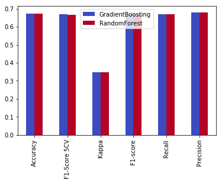


```python
scores= {'RandomForest': list(), 'GradientBoosting': list()}
```

# tf-idf


```python
df3=df
```

Calculating Tf-Idf on unigrams, bigrams and trigrams ( ngram_range=(1,3) ): 


```python
from sklearn.feature_extraction.text import TfidfVectorizer
#TfidfVectorizer-Convert a collection of raw documents to a matrix of TF-IDF features
tfidfvectorizer = TfidfVectorizer(analyzer = "word",tokenizer = None, ngram_range=(1,3), max_features = 5000, stop_words = None,min_df=1, use_idf=True)
tfidf_matrix = tfidfvectorizer.fit_transform(df3["message_clean"])
tfidf_matrix = tfidf_matrix.todense()
tfidf_matrix=np.c_[tfidf_matrix, df3.emoji, df3.emoji2, df3.sequence, df3.suffix2, df3.word_count, df3.sen_count,\
                  df3.punctuation, df3.topic_0, df3.topic_1, df3.topic_2, df3.topic_3, df3.suffix]

```

# RandomForestClassifier + tf-idf + topic modeling
best score: 0.7164


```python
msk = np.random.rand(len(df3)) < 0.8
train_x = tfidf_matrix[msk]
test_x = tfidf_matrix[~msk]
train_y = df3.loc[msk,"gender"]
test_y = df3.loc[~msk,"gender"]

# Initialize a Random Forest classifier with 100 trees
forest = RandomForestClassifier(criterion='gini', 
                         n_estimators=500, #The number of trees in the forest
                         min_samples_split=10,
                         min_samples_leaf=1,
                         max_features='auto',
                         oob_score=True,
                         random_state=1,
                         n_jobs=-1)

# Fit the forest to the training set, using the bag of words as 
# features and the gender labels as the response variable
forest = forest.fit( train_x, train_y )

# Evaluate accuracy best on the test set
score_rf=forest.score(test_x,test_y)
scores['RandomForest'].append(float(score_rf))
score_rf
```


    0.71648460774577949


```python
results=forest.predict(test_x)
c_matrix=confusion_matrix(test_y,results)   
classes=df3.gender.unique()
plot_confusion_matrix(c_matrix, classes)
plot_confusion_matrix(c_matrix, classes, normalize=True, title='Normalized confusion matrix')
```

    Confusion matrix
    [[796 211]
     [360 647]]
    Normalized confusion matrix
    [[ 0.79046673  0.20953327]
     [ 0.35749752  0.64250248]]
    

# GradientBoostingClassifier + tf-idf + topic modeling


```python
# Fit the forest to the training set, using the bag of words as 
# features and the gender labels as the response variable
GradientBoosting = GradientBoostingClassifier(max_depth=7, max_features=0.35000000000000003, min_samples_leaf=6, min_samples_split=13, n_estimators=100)
GradientBoosting.fit(train_x, train_y)
# Evaluate accuracy best on the test set
score_gb=GradientBoosting.score(test_x,test_y)
scores['GradientBoosting'].append(float(score_gb))
score_gb
```


    0.69563058589870908


```python
results=GradientBoosting.predict(test_x)
c_matrix=confusion_matrix(test_y,results)   
classes=df3.gender.unique()
plot_confusion_matrix(c_matrix, classes)
plot_confusion_matrix(c_matrix, classes, normalize=True, title='Normalized confusion matrix')
```

    Confusion matrix
    [[812 195]
     [418 589]]
    Normalized confusion matrix
    [[ 0.80635551  0.19364449]
     [ 0.41509434  0.58490566]]
    

# results (with tf-idf + topic modeling)


```python
res=pd.DataFrame()
res=pd.DataFrame(res.from_dict(scores))
res.index=['Accuracy']
res.plot(kind='bar', stacked=False, grid=False, colormap=colorm)
```


    <matplotlib.axes._subplots.AxesSubplot at 0x17ee33f5c88>


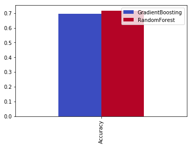


```python
res
```


<div>
<table border="1" class="dataframe">
  <thead>
    <tr style="text-align: right;">
      <th></th>
      <th>GradientBoosting</th>
      <th>RandomForest</th>
    </tr>
  </thead>
  <tbody>
    <tr>
      <th>Accuracy</th>
      <td>0.695631</td>
      <td>0.716485</td>
    </tr>
  </tbody>
</table>
</div>


```python

```
